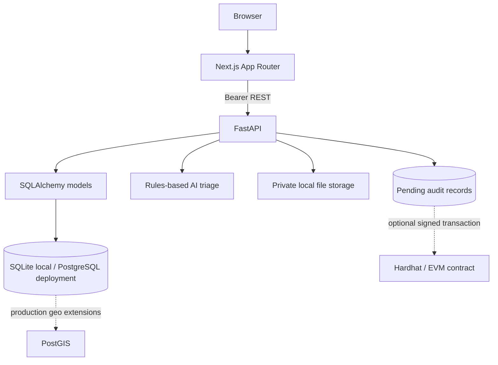

# Architecture

```mermaid
flowchart TB
  Browser --> Next[Next.js App Router]
  Next -->|Bearer REST| FastAPI
  FastAPI --> ORM[SQLAlchemy models]
  ORM --> DB[(SQLite local / PostgreSQL deployment)]
  DB -. production geo extensions .-> PostGIS
  FastAPI --> Triage[Rules-based AI triage]
  FastAPI --> Files[Private local file storage]
  FastAPI --> Audit[(Pending audit records)]
  Audit -. optional signed transaction .-> EVM[Hardhat / EVM contract]
```

Prototype boundaries and known gaps are described in the repository README.
